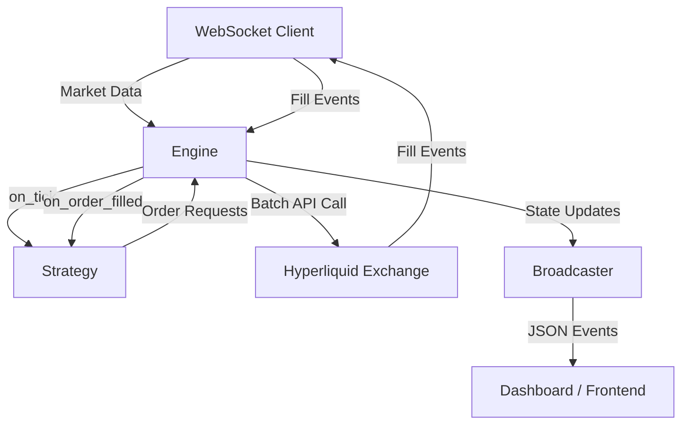

# Hyperliquid Trading Bot - Architecture Guide

## System Overview
The bot is an **Event-Driven, Asynchronous System**. It uses `tokio` for single-threaded async execution.

## Core Components

### 1. Engine (`src/engine/`)
- **Role**: The "Brain". Orchestrates everything.
- **Responsibilities**:
  - Maintains `hyperliquid_rust_sdk` connections (`InfoClient`, `ExchangeClient`).
  - Translates raw WS messages into internal types.
  - Routes events to the `Strategy` trait.
  - Handles error recovery and safety checks.
  - **CRITICAL**: Catches all strategy exceptions to prevent bot crashes.

### 2. Strategy (`src/strategy/`)
- **Role**: The "Logic". Contains trading algorithms.
- **Trait**: `Strategy`
  - `on_tick(price, ctx)`: Main decision loop.
  - `on_order_filled(...)`: Handle execution events.
  - `get_status_snapshot(ctx)`: Produce visualization data.
- **Implementations**:
  - `SpotGridStrategy`: Classic buy-low/sell-high grid for Spot.
  - `PerpGridStrategy`: Long/Short grid with leverage for Perpetuals.

### 3. Broadcaster (`src/broadcast/`)
- **Role**: Observability.
- **Tech**: `tokio-tungstenite`.
- **Function**:
  - Accepts `WSEvent` enums via broadcast channel.
  - Distributes events to all connected WebSocket clients.
  - Caches initial state to instantly sync new clients.

### 4. Reporter (`src/reporter/`)
- **Role**: Notifications.
- **Tech**: `teloxide`.
- **Function**:
  - Telegram bot with `/status` command.
  - Trade fill notifications.

## Data Models (`src/model.rs`)
- **`Cloid`**: Client Order ID. Typed wrapper to prevent ID mix-ups.
- **`OrderRequest`**: Base type for order creation.
- **`OrderFill`**: Normalized fill event with fee, role (maker/taker), and size.

## Design Principles
1. **Safety First**: Engine verifies checks and wraps strategy calls in error handling.
2. **Strategy Purity**: Strategies have no side effects. They return actions.
3. **Observability**: Real-time broadcasting for "glass box" monitoring.
4. **Documentation Sync**: Code changes require doc updates.
