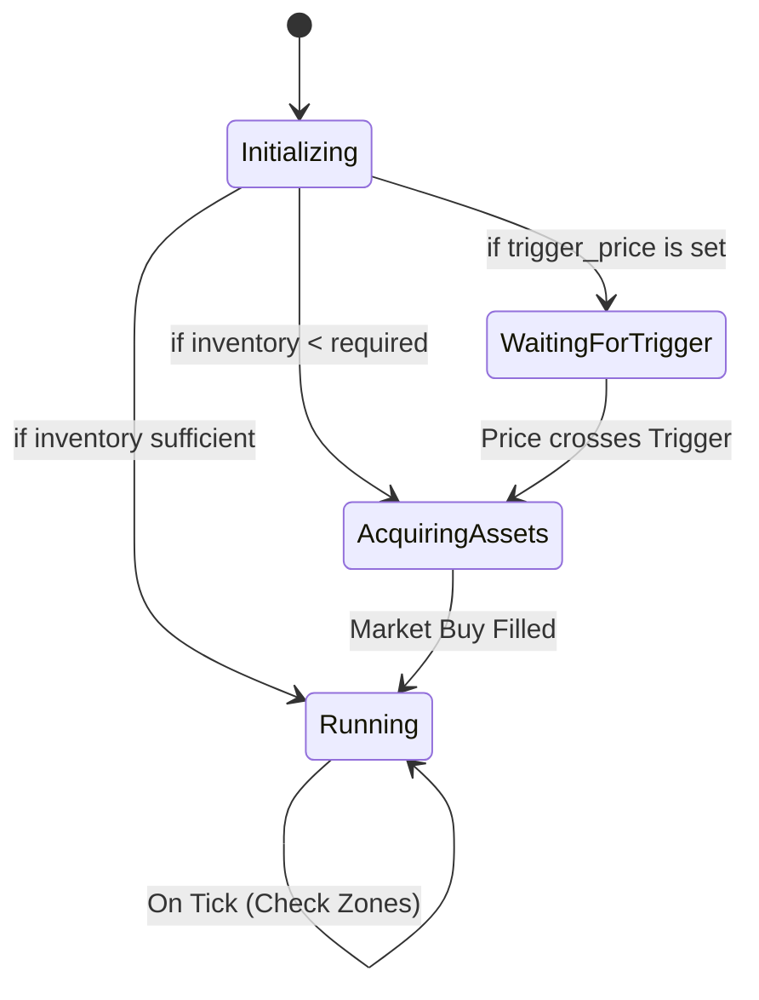
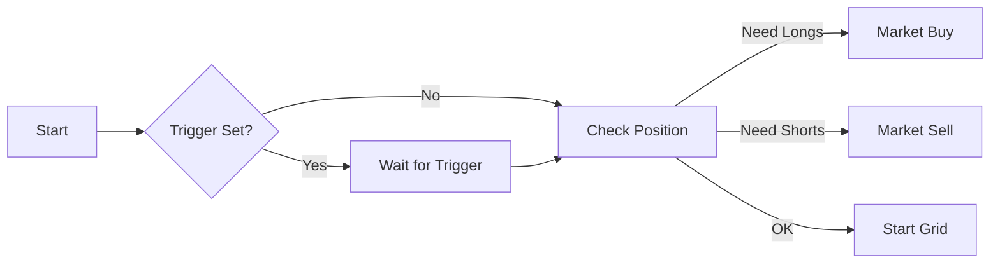

# Strategy Documentation

This document details the logic, parameters, and behavior of the two core strategies: **Spot Grid** and **Perp Grid**.

---

## 1. Spot Grid Strategy (`SpotGrid`)

A classic mean-reversion strategy that buys low and sells high within a defined price range. It holds base assets (e.g., HYPE, ETH) to sell at higher levels and quote assets (e.g., USDC) to buy at lower levels.

### Parameters

| Parameter | Type | Description |
| :--- | :--- | :--- |
| `symbol` | String | Trading pair (e.g., "HYPE/USDC"). |
| `upper_price` | f64 | The highest price of the grid range. Above this, the bot holds all Quote. |
| `lower_price` | f64 | The lowest price of the grid range. Below this, the bot holds all Base. |
| `grid_count` | u32 | Number of price levels. Creates `grid_count - 1` trading zones. |
| `total_investment` | f64 | Total Quote amount allocated to this strategy. |
| `grid_type` | Enum | `Arithmetic` (equal price difference) or `Geometric` (equal ratio). |
| `trigger_price` | Option<f64> | (Optional) Price to start the bot. If set, bot waits until price crosses this level. |

### Logic & State Machine

The strategy operates as a state machine:

#### 1. Initial Asset Acquisition
On startup, the bot calculates the required inventory (Base Asset) to populate all zones above the current price.
*   **If Inventory is Low**: It enters `AcquiringAssets` state and places a Market Buy to bridge the gap.
*   **If Inventory is Sufficient**: It proceeds directly to `Running`.

#### 2. Grid Zones
The range is divided into zones. Each zone has two states:
*   **WaitingBuy**: Current Price > Zone Upper. Ready to buy if price drops.
*   **WaitingSell**: Current Price < Zone Lower. Holding asset, ready to sell if price rises.

#### 3. Execution
*   When a **Buy Order** fills: The zone transitions to `WaitingSell`. A Sell Limit order is placed at the zone's upper price.
*   When a **Sell Order** fills: The zone transitions to `WaitingBuy`. A Buy Limit order is placed at the zone's lower price.

### Boundary Behavior
*   **Price > Upper Price**: All assets are sold (converted to Quote). Bot waits for price to drop.
*   **Price < Lower Price**: All capital is in Base Asset. Bot waits for price to rise. No new buy orders are placed.

---

## 2. Perp Grid Strategy (`PerpGrid`)

A grid strategy designed for Perpetual Futures, supporting Leverage and Long/Short bias. Instead of physical inventory, it manages a **Position**.

### Parameters

| Parameter | Type | Description |
| :--- | :--- | :--- |
| `symbol` | String | Perp pair (e.g., "HYPE-PERP"). |
| `leverage` | u32 | Leverage multiplier (e.g., 10x). |
| `grid_bias` | Enum | `Neutral`, `Long`, or `Short`. Determines initial positioning. |
| `upper_price` | f64 | Highest price of range. |
| `lower_price` | f64 | Lowest price of range. |
| `grid_count` | u32 | Number of levels. |
| `total_investment` | f64 | Margin (Collateral) allocated. |
| `trigger_price` | Option<f64> | (Optional) Activation price. |

### Logic & Features

#### 1. Grid Bias
*   **Neutral**: Distributes zones symmetrically. Holds Longs for sell-zones and Shorts for buy-zones (net position ~0).
*   **Long**: Accumulates a Net Long position. Buys dips to increase Long exposure, sells rips to reduce it (but stays Long).
*   **Short**: Accumulates a Net Short position.

#### 2. Leverage Management
The strategy explicitly manages margin. `total_investment` is the collateral. The actual position size controlled is `total_investment * leverage`.

#### 3. Initial Position
*   Similar to Spot, it calculates the required *initial position* based on the `grid_bias` and current price relative to the range.
*   If `trigger_price` is used, the initial acquisition happens only when the trigger is hit.

### Boundary Behavior (Perp)
*   **Price > Upper**:
    *   **Long Bias**: Position reduced to 0 (All sold).
    *   **Short Bias**: Max Short position reached (DANGER: Liquidation risk increases).
*   **Price < Lower**:
    *   **Long Bias**: Max Long position reached (DANGER: Liquidation risk increases).
    *   **Short Bias**: Position reduced to 0 (All bought back).

### Trigger Price Effect
If `trigger_price` is defined:
1.  Bot is "Idle" until price crosses the trigger.
2.  **Crucially**: The "Initial Price" for calculating zones is set to the `trigger_price`, not the market price at boot. This ensures the grid is aligned with your intended entry point.
