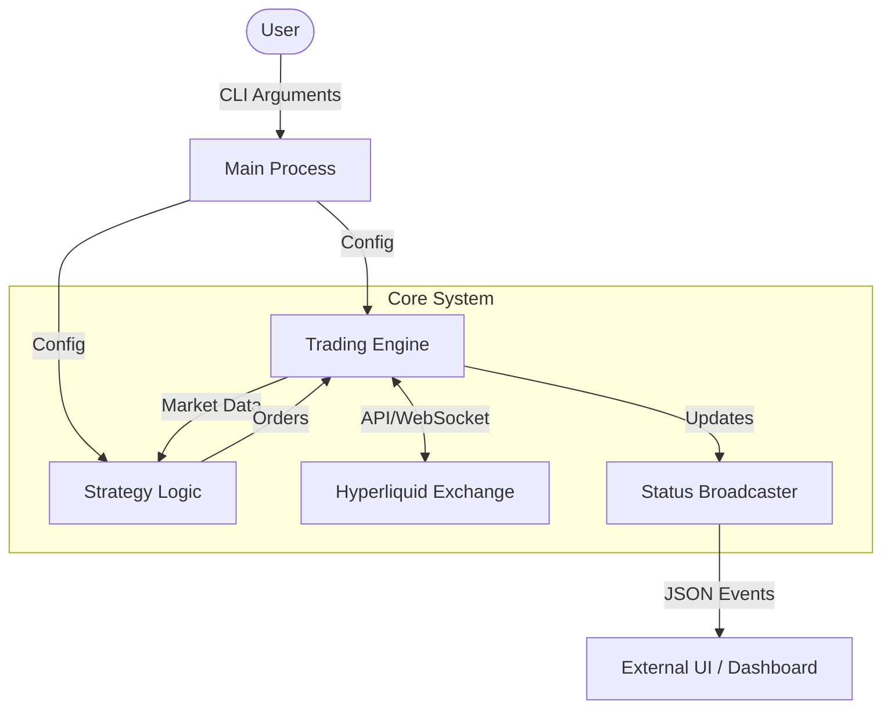
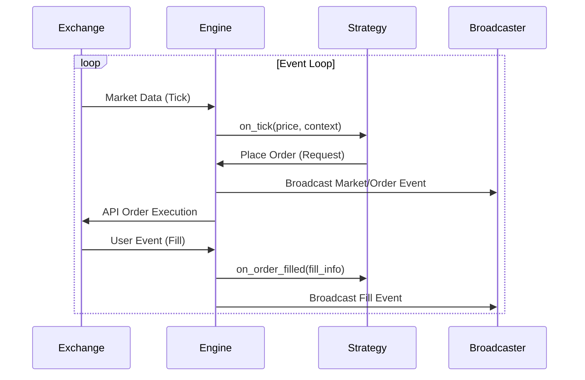

# System Architecture Design

## Overview
The Hyperliquid Trading Bot is an event-driven, modular Rust application designed for high-performance trading on the Hyperliquid exchange. It separates the trading engine, strategy logic, and exchange connectivity into distinct components, allowing for easy strategy development and robust execution.

## High Level Architecture

The system follows a classic **Engine-Structure** pattern:
*   **Engine**: The "brain" that orchestrates the event loop, manages state, handles exchange connections, and ensures safety (order tracking, error handling).
*   **Strategy**: Pure logic components that make decisions based on market data. They are unaware of API complexity.
*   **Broadcaster**: A sidecar WebSocket server that pushes internal state to external UIs in real-time.

## Data Flow

The application runs on a single-threaded Tokio event loop (with async IO).

## Component Breakdown

### 1. Engine (`src/engine`)
**Role**: Orchestrator.
*   **Responsibilities**:
    *   Manages WebSocket connections to Hyperliquid (`InfoClient`).
    *   Manages Signing/Ordering via `ExchangeClient`.
    *   Maintains the canonical `StrategyContext` (balances, open orders, market info).
    *   Route events (Ticks, Fills) to the generic `Strategy` trait.
    *   Handles broadcasting.

### 2. Strategy (`src/strategy`)
**Role**: Business Logic.
*   **Trait**: `Strategy`
    *   `on_tick(price, ctx)`: Main decision loop.
    *   `on_order_filled(...)`: Handling execution.
    *   `get_status_snapshot(ctx)`: Producing visualization data.
*   **Implementations**:
    *   `SpotGridStrategy`: Classic buy-low/sell-high grid for Spot.
    *   `PerpGridStrategy`: Long/Short grid with leverage for Perpetuals.

### 3. Broadcaster (`src/broadcast`)
**Role**: Observability.
*   **Tech**: `tokio-tungstenite`.
*   **Function**:
    *   Accepts `WSEvent` enums via a generic channel.
    *   Distributes events to all connected WebSocket clients.
    *   Caches initial state (`Config`) to instantly sync new clients.

### 4. Models (`src/model`)
**Role**: Data Definitions.
*   Defines unified types for `OrderRequest`, `OrderResponse`, and `MarketInfo` to decouple the Strategy from the raw SDK types.

## Key Design Principles
1.  **Safety First**: The Engine verifies basic checks (e.g., balance tracking) and wraps strategy calls in error handling to prevent crashes.
2.  **Platform Neutrality**: The `Strategy` trait is agnostic to the underlying exchange implementation (though currently specialized for Hyperliquid).
3.  **Observability**: Real-time broadcasting allows "glass box" monitoring rather than "black box" logging.
