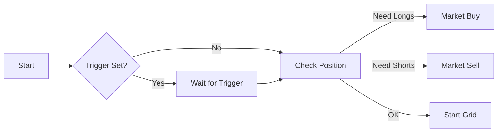

# Perp Grid Strategy (`PerpGrid`)

A grid strategy designed for Perpetual Futures, supporting Leverage and Long/Short bias. Instead of physical inventory, it manages a **Position**.

## Parameters

| Parameter | Type | Description |
| :--- | :--- | :--- |
| `symbol` | String | Perp pair (e.g., "HYPE-PERP"). |
| `leverage` | u32 | Leverage multiplier (e.g., 10x). |
| `grid_bias` | Enum | `Neutral`, `Long`, or `Short`. Determines initial positioning. |
| `upper_price` | f64 | Highest price of range. |
| `lower_price` | f64 | Lowest price of range. |
| `grid_count` | u32 | Number of levels. |
| `total_investment` | f64 | Margin (Collateral) allocated. |
| `trigger_price` | Option<f64> | (Optional) Activation price. |

## Logic & Features

### 1. Grid Bias
*   **Neutral**: Distributes zones symmetrically. Holds Longs for sell-zones and Shorts for buy-zones (net position ~0).
*   **Long**: Accumulates a Net Long position. Buys dips to increase Long exposure, sells rips to reduce it (but stays Long).
*   **Short**: Accumulates a Net Short position.

### 2. Leverage Management
The strategy explicitly manages margin. `total_investment` is the collateral. The actual position size controlled is `total_investment * leverage`.

### 3. Initial Position
*   Similar to Spot, it calculates the required *initial position* based on the `grid_bias` and current price relative to the range.
*   If `trigger_price` is used, the initial acquisition happens only when the trigger is hit.

## Boundary Behavior (Perp)
*   **Price > Upper**:
    *   **Long Bias**: Position reduced to 0 (All sold).
    *   **Short Bias**: Max Short position reached (DANGER: Liquidation risk increases).
*   **Price < Lower**:
    *   **Long Bias**: Max Long position reached (DANGER: Liquidation risk increases).
    *   **Short Bias**: Position reduced to 0 (All bought back).

## Trigger Price Effect
If `trigger_price` is defined:
1.  Bot is "Idle" until price crosses the trigger.
2.  **Crucially**: The "Initial Price" for calculating zones is set to the `trigger_price`, not the market price at boot. This ensures the grid is aligned with your intended entry point.
