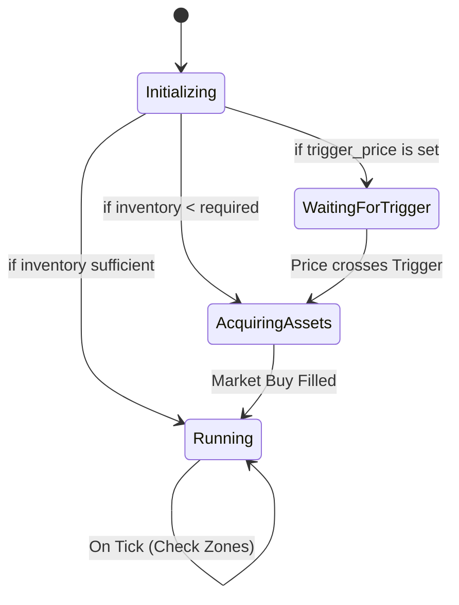

# Spot Grid Strategy (`SpotGrid`)

A classic mean-reversion strategy that buys low and sells high within a defined price range. It holds base assets (e.g., HYPE, ETH) to sell at higher levels and quote assets (e.g., USDC) to buy at lower levels.

## Parameters

| Parameter | Type | Description |
| :--- | :--- | :--- |
| `symbol` | String | Trading pair (e.g., "HYPE/USDC"). |
| `upper_price` | f64 | The highest price of the grid range. Above this, the bot holds all Quote. |
| `lower_price` | f64 | The lowest price of the grid range. Below this, the bot holds all Base. |
| `grid_count` | u32 | Number of price levels. Creates `grid_count - 1` trading zones. |
| `total_investment` | f64 | Total Quote amount allocated to this strategy. |
| `grid_type` | Enum | `Arithmetic` (equal price difference) or `Geometric` (equal ratio). |
| `trigger_price` | Option<f64> | (Optional) Price to start the bot. If set, bot waits until price crosses this level. |

## Logic & State Machine

The strategy operates as a state machine:

### 1. Initial Asset Acquisition
On startup, the bot performs a **Strict Balance Check**:
1.  Calculates the required inventory (Base Asset) to populate all zones above the current price.
2.  Checks `Available Base Balance`.
3.  **Validation**: If a deficit exists, it calculates the estimated cost in Quote (USDC). If `Available Quote Balance < Estimated Cost`, the bot **exits with an error**. It will not start with insufficient funds.

If funds are sufficient:
*   **If Inventory is Low**: It enters `AcquiringAssets` state and places a Market Buy to bridge the gap.
*   **If Inventory is Sufficient**: It proceeds directly to `Running`.

### 2. Grid Zones
The range is divided into zones. Each zone has two states:
*   **WaitingBuy**: Current Price > Zone Upper. Ready to buy if price drops.
*   **WaitingSell**: Current Price < Zone Lower. Holding asset, ready to sell if price rises.

### 3. Execution
*   When a **Buy Order** fills: The zone transitions to `WaitingSell`. A Sell Limit order is placed at the zone's upper price.
*   When a **Sell Order** fills: The zone transitions to `WaitingBuy`. A Buy Limit order is placed at the zone's lower price.

## Boundary Behavior
*   **Price > Upper Price**: All assets are sold (converted to Quote). Bot waits for price to drop.
*   **Price < Lower Price**: All capital is in Base Asset. Bot waits for price to rise. No new buy orders are placed.

## WebSocket Data (`custom`)
The `status` event contains strategy-specific data in the `custom` field.
For the authoritative JSON Schema definition, see **[schema.json](../api/schema.json)** (Look for `Spot Grid Custom Data` definitions).
