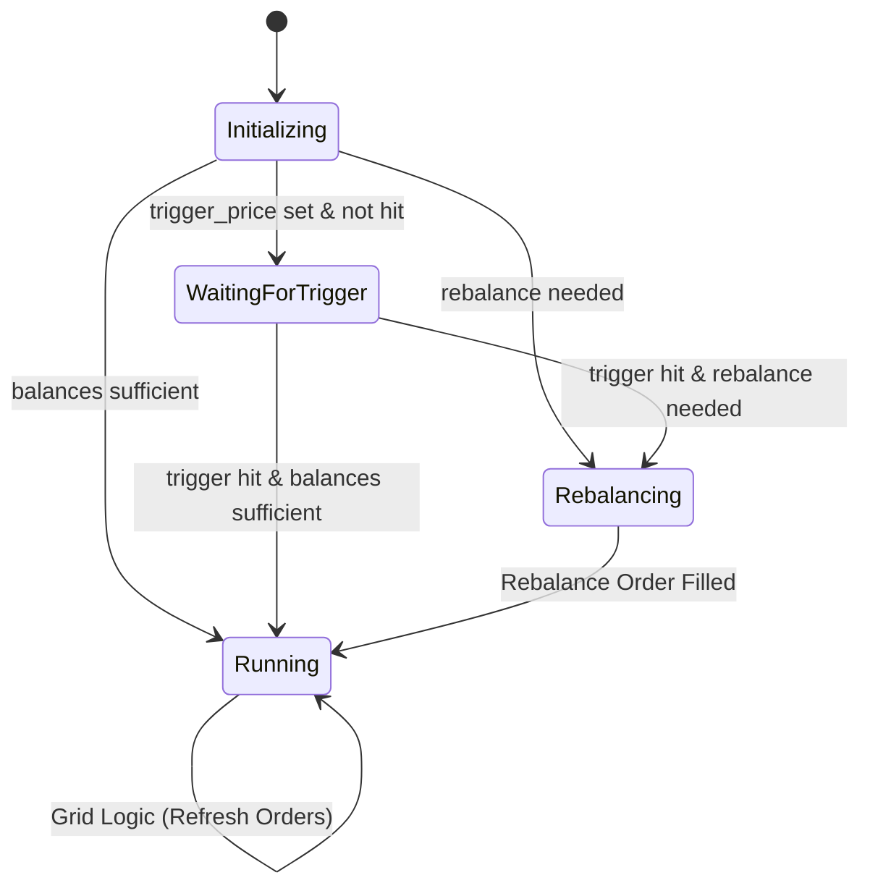

# Spot Grid Strategy (`SpotGrid`)

A classic mean-reversion strategy that buys low and sells high within a defined price range. It holds base assets (e.g., HYPE, ETH) to sell at higher levels and quote assets (e.g., USDC) to buy at lower levels.

## Parameters

| Parameter | Type | Description |
| :--- | :--- | :--- |
| `symbol` | String | Trading pair (e.g., "HYPE/USDC"). |
| `upper_price` | f64 | The highest price of the grid range. Above this, the bot holds all Quote. |
| `lower_price` | f64 | The lowest price of the grid range. Below this, the bot holds all Base. |
| `grid_count` | u32 | Number of price levels. Creates `grid_count - 1` trading zones. |
| `total_investment` | f64 | Total Quote amount allocated to this strategy. |
| `grid_type` | Enum | `Arithmetic` (equal price difference) or `Geometric` (equal ratio). |
| `trigger_price` | Option<f64> | (Optional) Price to start the bot. If set, bot waits until price crosses this level. |

## Logic & State Machine

The strategy operates as a state machine to ensure correct asset allocation before the grid starts:

### 1. Pre-Flight Validations
Before placing any orders, the bot performs two critical checks:

1.  **Minimum Notional Validation**: Ensures that `total_investment / (grid_count - 1)` is at least **$11.0**. If the investment per zone is too low, the strategy fails to initialize.
2.  **Total Portfolio Value Check**: Calculates `Total Value = (Available Base * Price) + Available Quote`. 
    *   The **Price** used is the `trigger_price` (if set) or current market price.
    *   If `Total Value < total_investment`, the bot **exits with an error**. You must have enough total funds across both assets to cover the requested grid investment.

### 2. Bidirectional Asset Rebalancing
If the total value is sufficient but the specific asset split is wrong for the current price, the bot performs **Active Rebalancing**:

*   **Buying Base**: If you have too much USDC and not enough BTC for the "Sell" zones, the bot places a **Limit Buy** order (at the `initial_price`) to acquire the deficit.
*   **Selling Base**: If you have enough BTC but not enough USDC for the "Buy" zones, the bot places a **Limit Sell** order (at the `initial_price`) to generate the required quote liquidity.

Once the rebalancing order is filled, the bot seeds its internal `inventory` tracking with the actual wallet balance and starts the grid.

### 3. Execution
The grid consists of multiple `zones`:
*   **WaitingBuy**: Current Price > Zone Upper. Ready to buy if price drops.
*   **WaitingSell**: Current Price < Zone Lower. Holding asset, ready to sell if price rises.

When an order fills, the zone "flips" its state and places a counter-order on the opposite boundary.

## Boundary Behavior
*   **Price > Upper Price**: All assets are sold (converted to Quote). Bot waits for price to drop.
*   **Price < Lower Price**: All capital is in Base Asset. Bot waits for price to rise. No new buy orders are placed.

## WebSocket Data (`custom`)
The `status` event contains strategy-specific data in the `custom` field, including `inventory`, `avg_entry_price`, and `total_fees`.
For the authoritative JSON Schema definition, see **[schema.json](../api/schema.json)**.
